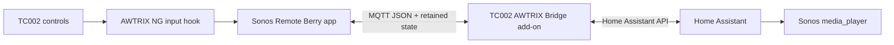

# Sonos Remote for AWTRIX NG on Ulanzi TC002

Sonos Remote temporarily turns an Ulanzi TC002 running AWTRIX NG into a
physical controller for one Home Assistant `media_player`. The app pauses the
normal carousel, shows the current artist and title, and routes the TC002's
controls to Sonos without storing a Home Assistant token on the clock.

This repository contains the reusable Berry app, the integration contract, and
the exact proof-of-concept firmware patch used to make the remote available
from any carousel page. It does **not** contain firmware binaries, device
backups, MQTT credentials, Home Assistant tokens, or the third-party LaMetric
icon artwork.


## Controls

| TC002 control | Sonos action |
| --- | --- |
| Hold the main knob | Enter or leave exclusive Sonos Remote mode |
| Short knob press | Play/pause; optionally start configured media on first press |
| Rotate clockwise | Next track |
| Rotate counter-clockwise | Previous track |
| Rocker `+` / `-` | Raise/lower Sonos volume by the configured step |

The rocker changes the Sonos player only. It does not change the TC002's local
speaker volume. Each rocker press restarts a two-second volume overlay, and the
app ignores stale Home Assistant volume reports during the short settling
window.

## Architecture



The Berry app publishes a small allow-listed command object to
`tc002/sonos_remote/v2/command`. The bridge verifies the selected entity begins
with `media_player.`, fetches it from Home Assistant, accepts only the supported
actions, and calls the relevant `media_player` service. State is returned under
`tc002/sonos_remote/v2/state/`. See [the architecture document](docs/ARCHITECTURE.md)
for the complete flow and concurrency rules.

## Requirements

- Ulanzi TC002 with an AWTRIX NG TC002 build that supports Berry scripts.
- MQTT enabled on both AWTRIX NG and Home Assistant, using the same broker.
- [TC002 AWTRIX Bridge Home Assistant add-on](https://github.com/lucaamo/tc002-awtrix-ha-addon)
  version `0.2.47` or newer.
- A Sonos entity exposed in Home Assistant as `media_player.*`.
- For the global hold gesture, a firmware integration equivalent to the
  proof-of-concept patch in this repository. The patch itself targets one exact
  historical TC002 port commit; read its warning before using it.

## Install the Home Assistant side

1. Add `https://github.com/lucaamo/tc002-awtrix-ha-addon` as a Home Assistant
   add-on repository, then install and start **TC002 AWTRIX Bridge**.
2. Configure the add-on to use the same MQTT broker as AWTRIX NG. Prefer a
   dedicated MQTT account and keep its password in Home Assistant/AWTRIX
   settings, never in this repository or the Berry source.
3. In the bridge Sonos settings, select the intended `media_player` and set the
   volume step, optional favourite/playlist URI, content type, and long-press
   duration. The Berry app can also select the player; the bridge verifies that
   it exists before accepting a command.
4. Leave the MQTT topic root at `tc002/sonos_remote/v2` unless you also change
   the bridge implementation.

The bridge uses these Home Assistant services:

- `media_player.media_play_pause`
- `media_player.media_next_track`
- `media_player.media_previous_track`
- `media_player.volume_set`
- `media_player.play_media`

Command services are called without `?return_response`, because these services
may otherwise return HTTP 400.

## Install the Berry app

Open the AWTRIX NG web interface, create a script named `sonos_remote` in the
**Scripts** tab, paste [apps/sonos_remote.ax](apps/sonos_remote.ax), and save it.
The compiler result must report `error: null`.

The same install can be scripted:

```sh
curl -fsS -X PUT "http://AWTRIX_IP/api/v1/apps/script/sonos_remote" \
  -H 'Content-Type: text/plain' \
  --data-binary @apps/sonos_remote.ax
```

Then open **Apps → Sonos Remote → settings** and configure:

| Setting | Meaning |
| --- | --- |
| MQTT topic root | Keep `tc002/sonos_remote/v2` with the published bridge |
| Sonos player entity | Home Assistant entity, for example `media_player.living_room` |
| Volume step | Percentage points per rocker press |
| Long press | Hold duration used to enter/leave the remote |
| Playlist, favourite or URI | Optional media started by the first short press |
| Media content type | Home Assistant type matching that media identifier |
| Music icon colour | Colour used by the built-in compact fallback icon |

Examples for `play_media`:

- Sonos favourite: `SQ:10` with type `favorite_item_id`.
- Spotify playlist: `spotify:playlist:PLAYLIST_ID` with type `playlist`.

Player support for a content id/type pair should first be checked with Home
Assistant's action tester.

### Optional Music Meter icon

The tested device uses a locally resized `10×10` copy of LaMetric icon `22046`
under the name `sonos_music_meter`. That file is not included because its
redistribution terms were not established. Without it, the app draws a compact
animated equalizer itself and remains fully functional.

## Global long-press shortcut

An ordinary Berry app receives button events only while it is visible. The full
experience therefore needs a small native hook that:

1. watches the main knob from every carousel page;
2. opens `sonos_remote` after the configured hold time;
3. gives the active script first refusal on rotary and rocker events;
4. leaves the exit hold to the visible app, avoiding an immediate reopen.

The file in [`patches/`](patches/) is the implementation used for the physical
prototype. It is reference material for upstreaming a generic shortcut API,
not a patch to apply blindly to current AWTRIX NG. The upstream design proposal
is tracked in [AWTRIX NG discussion #66](https://github.com/Blueforcer/awtrix-ng/discussions/66).

## Verification status

On a physical TC002, the prototype has verified:

- entry by holding the knob from a normal carousel page;
- an exclusive screen that remains visible during control;
- play/pause, next, previous, and separate Sonos volume control;
- the two-second volume overlay and delayed state reconciliation;
- exit by a second hold and return to the normal carousel;
- persistence across two normal power cycles;
- stock Ulanzi fallback at boot through the port's existing recovery gesture.

The current public source adds only an icon fallback to the tested Berry logic.
Run the checks in [docs/TESTING.md](docs/TESTING.md) before publishing changes.

## License and trademarks

This project is distributed under the
[PolyForm Noncommercial License 1.0.0](LICENSE.md) and preserves the AWTRIX NG
required notice. See [NOTICE.md](NOTICE.md) for provenance and third-party
terms. AWTRIX, Ulanzi, Sonos, Home Assistant, Spotify, and LaMetric are names or
trademarks of their respective owners; this is an unofficial community project.
