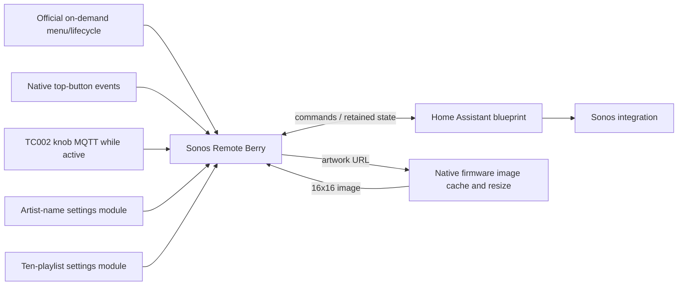

# Architecture and extension guide

## Components

`apps/sonos_remote.ax` is an on-demand tool; the firmware loads it only when
started and unloads it on exit. `apps/sonos_artist_names.ax` is an imported
settings module; `apps/sonos_playlists.ax` owns ten ordered playlist settings.
`home-assistant/sonos_remote.yaml` uses native HA automations,
MQTT and Sonos integrations. The TC002 AWTRIX Bridge add-on is not a dependency.
The code stores no HA token or broker password.

## Lifecycle and input

`@ondemand` keeps the app out of the carousel. Firmware select-hold opens its
menu globally. Menu or HTTP launch constructs a fresh app and runs `setup()`.
The app starts its control state there: beta 1.1.5's API start path did not
invoke `on_show()` consistently in the smoke test. `on_show()` is an idempotent
fallback. The firmware, not manual `rotation.pause()`, owns exclusive display.

`on_button_event` claims top-button presses. Left/right presses and repeat
change Sonos volume. Select events cause no music action; its short press and
the firmware's synthetic release cannot accidentally confirm a playlist or
toggle playback. Native select-hold always exits the on-demand session,
including when navigation is blocked.

The app subscribes to `<device_root>/state/buttons/knob` and
`<device_root>/event/knob` only while loaded. It never subscribes to MQTT copies
of left/right/select. Knob button edges distinguish short press from picker hold;
rotary `turn` direction either selects a playlist or requests next/previous.
Only the release resolves a knob gesture. A release at or above `long_ms`
opens the picker during music or cancels an open picker; it never also executes
the short action. An unmatched release is ignored. Inactive/pending-exit
sessions ignore all knob input. Short knob press confirms an open picker or
toggles music. No configured playlists means a long hold is a harmless no-op.
`blockNavigation=true` suppresses the local knob brightness/volume panel and
Assist path. `on_hide()` resets held presses, timers and navigation blocking.
The backend-loss failsafe's `exit_mode()` publishes a non-retained empty payload to the clock's native
`<device_root>/cmd/apps/next` command. On beta 1.1.5 `rotation.next()` inside
the on-demand callback reopened Sonos Remote; native HTTP/MQTT next correctly
unloads it. This distinction must be checked on real firmware, not replaced by
a mock that assumes all rotation calls end a session.

Pending exit consumes subsequent inputs and retries at most once per 2.5
seconds until native `on_hide()` runs. API next/previous, showing another app,
saving settings and unloading also end it. A missing backend heartbeat requests
the same exit after 65 seconds. If MQTT itself is unavailable, use the firmware's
local top-select hold; reconnect allows the pending exit request to complete.
A backend refresh request does not fabricate a received heartbeat.

Entry by global knob hold belongs only to the compatibility v2 app. It is not
available in the native v3 adapter because inactive on-demand scripts do not
run or receive MQTT callbacks.

## MQTT protocol

The default root is `tc002/sonos_remote/v2`; it remains configurable to preserve
protocol compatibility. Use a unique root per automation/remote. Commands are
non-retained JSON objects sent to `<root>/command`, always including the
configured `player_entity_id`. The blueprint requires exact equality with its
selected entity and accepts only these actions:

| Action | Extra fields | Native HA action |
| --- | --- | --- |
| refresh | none | publish current metadata |
| play_pause | none | media_player.media_play_pause |
| next | none | media_player.media_next_track |
| previous | none | media_player.media_previous_track |
| volume | numeric value 0–100, excluding booleans | media_player.volume_set |
| delta | numeric value −25–25, excluding booleans | media_player.volume_set |
| play_media | nonempty media_content_id ≤768 chars; type ≤64 chars | media_player.play_media |

Services are fixed branches, never derived from arbitrary incoming strings.
Malformed JSON, lists/scalars, wrong entity, unknown actions and invalid values
are stopped before any service call. A delta requires a known current volume
and clamps the result to 0–1. Unknown/unavailable players receive no media
command. Service failures appear in HA automation traces; they are not presented
as successful commands. Native actions require no `?return_response`.

MQTT topic roots are limited to 96 characters with no trailing slash, wildcard
`+`/`#` or newline. The broker must permit the configured command, state and
clock input topics. Do not retain commands: clear any retained command left by
another publisher before enabling an automation. This is a local authenticated
MQTT protocol, not a remote authorization boundary.

Retained text state topics: `artist`, `title`, `playing`, `volume` (0–100),
`player_name`, `error`, `heartbeat`, all under `<root>/state/`. Empty volume means
unknown, never a fabricated zero. State changes, HA startup, a 30-second timer
and refresh commands publish metadata. Empty title/artist have app fallbacks.
`error` describes an unavailable player; detailed service errors stay in traces.

## Concurrency and feedback

HA `mode: queued` serializes commands and refreshes, with a bounded 30-run queue.
Overflow is logged rather than creating an unlimited backlog. State is read at
**execution time**, never copied from an old queued trigger. Commands and
metadata therefore do not race independently in the automation.

The Berry app uses an optimistic absolute volume once known; otherwise it sends
a bounded delta. Every native press/repeat resets the two-second overlay. The
three-second settling window ignores stale values even after a matching echo.
Afterward, live observed volume replaces the optimistic value. Reports do not
cancel the overlay. A service failure can therefore reconcile the display to
the unchanged actual volume; no arbitrary acknowledgment is fabricated.

Berry handlers and drawing run in the firmware script context. Network JSON is
parsed in callbacks, not in `draw()`. Do not add blocking waits or downloads to
that drawing path. Do not run an old add-on and blueprint on the same root.

## Playlists and display

Ten Berry `Name|content id|content type` settings belong to `sonos_playlists`.
The module reads its own store at top level, traversing slots 1–10 in numeric
order, and exports the nonempty specifications. `SonosRemote.init()` parses
these into a session-local list. Blank/malformed entries do not create picker
items; a sparse list including slot ten remains in its configured order.
No configured entries means immediate now-playing controls. Otherwise entry
opens the picker. Rotation selects an entry and a short knob press sends
`play_media`, then closes the picker. A long knob hold during music reopens
it at the last highlighted index; another long hold cancels. The index is
session-local, never written to flash, and starts at zero on fresh launch.
Opening and rotation restart `picker_ms`; metadata updates do not alter the
deadline. Cancel/timeout close it without changing playback. Opening clears
only `osd_until`, preserving the independent stale-volume settling window.
Volume buttons remain usable in the picker; subsequent volume feedback keeps
its normal two-second priority. Sonos favourites use e.g. `SQ:10`
with `favorite_item_id`; Spotify URIs use `spotify:playlist:ID` and `playlist`.
The receiving Sonos integration decides content support; no Spotify credentials
are required by this protocol.

52×16 layout: optional 16×16 artwork at x=0..15, separator x=16, two text rows in
x=17..51. Artist baseline 5, title baseline 14; white and centred where fitting.
Artist is uppercase; title preserves received case. Geometry uses the firmware's
current text font and `text_ink_width`, not string length to determine fit.

Long artist names use one full pass then a centred explicit fitting alias.
Unconfigured groups or oversized aliases continue scrolling. Duplicate artist
reports do not reset the completed pass. A changed artist/session toggles the
700/701 ms scroll hold option because the firmware's scroll bank keys state by
geometry/options, not text identity. The name module reads one global rule
list and optional global overrides, both empty by default.
Module 2.0.0 reads `rules` then `overrides`; it has no playlist-specific keys.
A `*` override cancels any abbreviation for that artist. No artist or playlist
catalogue is required. Migrating 1.x settings is explicit, documented in the README.

Artwork payloads contain width=16, height=16 and `image`. On TC002 beta 1.1.6,
an HTTP(S) URL (at most 2048 characters, no whitespace) is passed directly to
native `icon()`. The firmware owns downloading, JPEG/PNG resizing and caching.
The blueprint can resolve a relative `entity_picture` using a configurable HA
base URL and publish this URL; it does not download or convert the picture.
An empty or unavailable picture clears stale artwork. While a download is
pending or cannot decode, the app draws its optional icon or built-in meter.

Static 16×16 GIF data URIs (at most 4096 characters) and the earlier payload
with exactly 256 integer RGB888 pixels (0..0xFFFFFF) remain accepted. Inline
JPEGs are rejected because their firmware limits differ from URL pictures.
The fallback-only blueprint default preserves older installations. With
fallback-only disabled and an empty base URL, the blueprint leaves an existing
external artwork publisher alone. With a base URL, it becomes the only artwork
publisher; remove any previous converter to prevent competing updates.

## HTTP and settings

The existing AWTRIX API supplies the UI and deployment; this project adds no
firmware HTTP route:

- GET `/api/v1/apps` exposes on-demand registration and errors.
- GET/PUT `/api/v1/apps/script/<name>` reads/installs complete Berry source.
- GET/PATCH `/api/v1/apps/<name>/config` reads/updates declared settings (flat JSON patch).
- PUT `/api/v1/apps/active` starts the requested app.
- POST `/api/v1/apps/next` ends the session and advances.
- GET `/api/v1/display/screen` reads the actual framebuffer.
- DELETE `/api/v1/apps/<name>` removes a disposable app.

Firmware stores and validates bounded `# @config` fields. Source defaults are
neutral. Home Assistant blueprint selectors collect the Sonos entity and root;
HA validates the automation schema, and runtime protocol validation checks
incoming commands. Module/app saves restart dependent code; native lifecycle
releases input ownership. The remote uses eight config slots and the playlist
module ten. TC002 beta 1.1.5 accepts at least 30 declared fields, as verified
with an isolated module, but the current web UI has no column/group metadata.
During a 3.1.0
upgrade, read/back up the four old app playlist fields and save them in the new
module before updating the app; verify all eight remaining app values afterward.
Never read module settings through the importing app's `store` identity.

## Extend safely

For a new command, add a specific Berry event mapping, an allow-listed payload
with bounded fields, and a fixed HA `choose` service branch. Refresh state after
the completed service. Add rejection fixtures and actual-runtime input checks.
Do not map the same physical button through native and MQTT paths.

For a new option, declare a bounded `# @config` or a typed blueprint input,
read it once under its owning store/automation identity, preserve legacy keys
on upgrade, and document a safe default. If adding an optional integration,
keep its credentials off the clock and preserve the no-artwork/basic-control
path. Test clean settings, unload/exit and backend loss before distribution.
